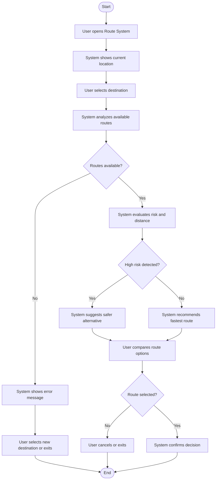

# Decisions

```mermaid
flowchart TD
    Start([Start]) --> A[User opens Route System]
    A --> B[System shows current location]
    B --> C[User selects destination]
    C --> D[System analyzes available routes]
    D --> E{Routes available?}
    
    E -->|No| F[System shows error message]
    F --> G[User selects new destination or exits]
    G --> End([End])
    
    E -->|Yes| H[System evaluates risk and distance]
    H --> I{High risk detected?}
    
    I -- Yes --> J[System suggests safer alternative]
    I -- No --> K[System recommends fastest route]
    
    J --> L[User compares route options]
    K --> L
    
    L --> M{Route selected?}
    M -->|No| N[User cancels or exits]
    N --> End
    
    M -->|Yes| O[System confirms decision]
    O --> End

```

  
⚙️ System-Setup

  

