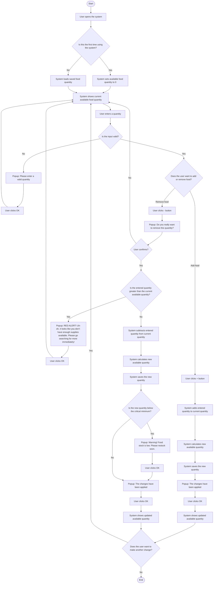

# Flowchart

```mermaid
flowchart TD
    A([Start]) --> B[User opens the system]
    B --> C{Is this the first time using the system?}

    C -- Yes --> D[System sets available food quantity to 0]
    C -- No --> E[System loads saved food quantity]

    D --> F[System shows current available food quantity]
    E --> F

    F --> G[User enters a quantity]
    G --> H{Is the input valid?}

    H -- No --> I["Popup: Please enter a valid quantity"]
    I --> J[User clicks OK]
    J --> F

    H -- Yes --> K{Does the user want to add or remove food?}

    K -- Add food --> L[User clicks + button]
    L --> M[System adds entered quantity to current quantity]
    M --> N[System calculates new available quantity]
    N --> O[System saves the new quantity]
    O --> P["Popup: The changes have been applied"]
    P --> Q[User clicks OK]
    Q --> R[System shows updated available quantity]
    R --> S{Does the user want to make another change?}

    K -- Remove food --> T[User clicks - button]
    T --> U["Popup: Do you really want to remove this quantity?"]
    U --> V{User confirms?}

    V -- No --> F
    V -- Yes --> W{Is the entered quantity greater than the current available quantity?}

    W -- Yes --> X["Popup: RED ALERT! Uh-oh, it looks like you don’t have enough supplies available. Please go searching for more immediately!"]
    X --> Y[User clicks OK]
    Y --> F

    W -- No --> Z[System subtracts entered quantity from current quantity]
    Z --> AA[System calculates new available quantity]
    AA --> AB[System saves the new quantity]
    AB --> AC{Is the new quantity below the critical minimum?}

    AC -- Yes --> AD["Popup: Warning! Food stock is low. Please restock soon."]
    AD --> AE[User clicks OK]
    AE --> AF["Popup: The changes have been applied"]

    AC -- No --> AF

    AF --> AG[User clicks OK]
    AG --> AH[System shows updated available quantity]
    AH --> S

    S -- Yes --> F
    S -- No --> AI([End])

```

  
⚙️ System-Setup

  

